<div align="center">

# PS5 Vulkan Template

**Everything needed to build a PlayStation 5 homebrew powered by Vulkan, in one repository.**

A foundation that starts, reads the pad, draws and ends the way a console title
must, a generator that makes a new title in one command, sixteen Vulkan samples
to copy from, a UI kit of complete designs and themes, a test suite that checks
every frame on the console, and agent skills for the whole stack.

<a href="ps5/screenshots/vulkan-template.mp4">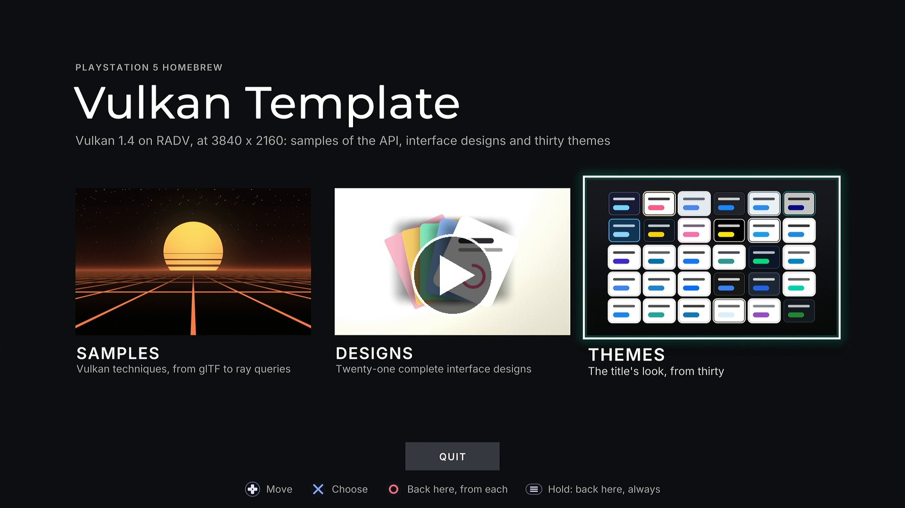</a>

<sub>15 seconds of Vulkan Template on my console, through a capture card: the title renders at 3840 x 2160, the clip is the card's 1920 x 1080 at 60 fps.</sub>

**16 Vulkan samples** &middot; **21 designs** &middot; **30 themes** &middot; **4 agent skills**
&middot; **43 of 43 programs pass on the console** &middot; **Vulkan 1.4 on RADV** at 3840 x 2160

[Samples](#the-samples) &middot;
[Designs](#the-designs) &middot;
[Themes](#the-themes) &middot;
[How the port works](ps5/README.md) &middot;
[The UI module](ps5/ui/README.md) &middot;
[Assets](ps5/ASSETS.md) &middot;
[For AI agents](AGENTS.md)

</div>

## Why this exists

A PS5 homebrew that renders with Vulkan needs more than a renderer: a Vulkan
driver built for the console, a platform layer under it, a program that starts,
reads the pad and ends the way the console expects, a way to see what happened
on the console from a PC, and a great deal of trial on real hardware. Each piece
is a project of its own.

This repository puts them together, proven on my console, so a new title starts
from something that already runs. One command makes the title, three build, deploy
and test it, and the test suite says whether the console drew the right frames.
Everything an agent needs to work on it is written down beside the code.

## What is in the box

| | |
| --- | --- |
| **A foundation** | Sascha Willems' Vulkan example base class with PS5 hooks, and a PS5 layer: launch, the pad (every reading of the frame, rumble, light bar), sound, klog, the 3840 x 2160 display at 119.88 Hz, test runs, and the exit through the shell a title must use. |
| **A title generator** | [`new-title.py`](ps5/tools/new-title.py) makes a new title in one command: the foundation and one program, grown from the 3D starter or, with `--ui <design>`, from one of the kit's designs. |
| **Sixteen Vulkan samples** | From glTF and PBR to mesh shaders and ray queries, each a class on the same base, so a technique copies into any title as it stands. |
| **A UI kit** | BlackBearReloaded's [ps5-homebrew-ui](https://github.com/blackbearreloaded/ps5-homebrew-ui), drawn with Vulkan through my fork [PS5_VKHomebrewUI](https://github.com/mihawk-99/PS5_VKHomebrewUI): 21 complete designs, 30 themes, 99 components and 67 sounds. An opt-in GPL-3.0 module: a title made without it stays MIT at source. |
| **A start screen** | Vulkan Template, the samples title, opens on Samples, Designs and Themes; the theme picked in Themes dresses its menus and the samples' settings windows. |
| **A test suite** | Each program runs for a frame budget on the console; its last frame is compared with the same frame drawn by the PC's Vulkan driver, and klog is checked for crash records, GPU faults and driver errors. |
| **Agent skills** | [`AGENTS.md`](AGENTS.md) and four skills with nineteen reference files: making and building titles, the console, porting existing software, releases. |
| **Tools** | Bootstrap, build, deploy, run and verdicts, host references, contact sheets and side-by-side comparisons, in [`ps5/tools/`](ps5/tools). |
| **The driver** | RADV, Mesa's Vulkan driver, built for the console from my [PS5_Mesa](https://github.com/mihawk-99/PS5_Mesa) fork and linked into each title by [PS5_Vulkan](https://github.com/mihawk-99/PS5_Vulkan), on the platform layer of my [PS5_PayloadSDK](https://github.com/mihawk-99/PS5_PayloadSDK) fork. It reports Vulkan 1.4 on the console. |

## The samples

Each one is a complete class on the same base: its members, its setup, its
commands and its shaders copy into a title as they stand. Every picture is the
console's own last frame of a 300-frame run (`ps5/tools/run.sh launcher all`,
2026-10-02): all passed at 119.9 fps and 3840 x 2160, each within 4.5 levels in
255 of my PC driver's frame. Click a picture for the sample's source; the numbers
per sample are in [`ps5/README.md`](ps5/README.md).

<table>
<tr>
<td width="50%" valign="top"><a href="examples/starter">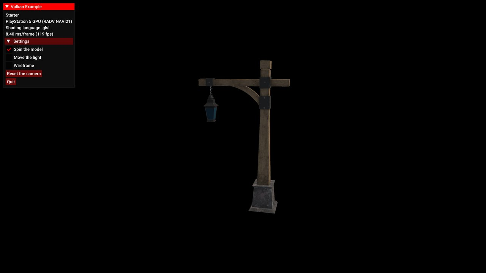</a><br><b>01 &middot; Starter</b><br><sub>The program a new homebrew grows from: a textured, lit glTF model and a settings window</sub></td>
<td width="50%" valign="top"><a href="examples/gltfloading">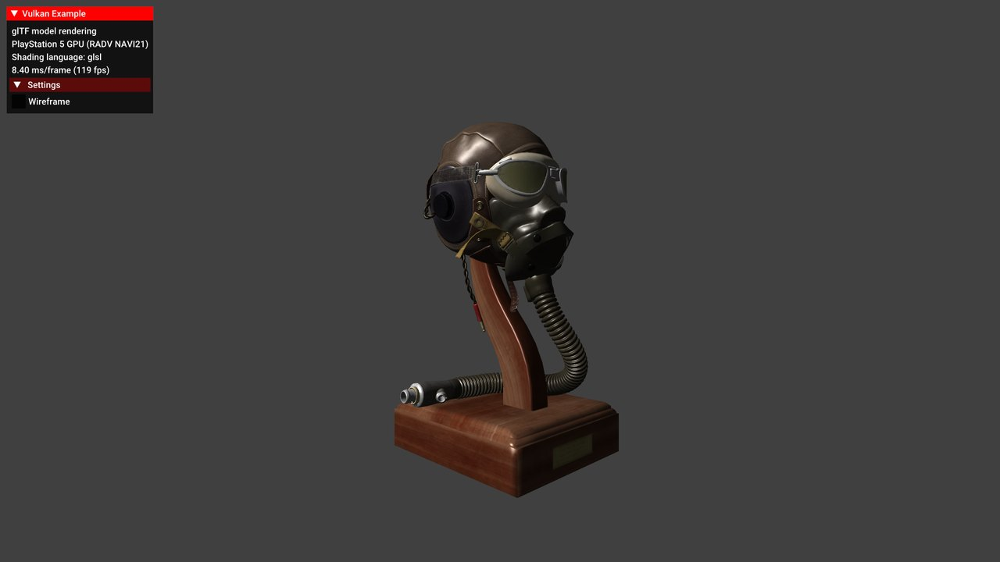</a><br><b>02 &middot; glTF model loading</b><br><sub>A glTF scene: meshes, materials, textures, node hierarchy</sub></td>
</tr>
<tr>
<td width="50%" valign="top"><a href="examples/texturemipmapgen">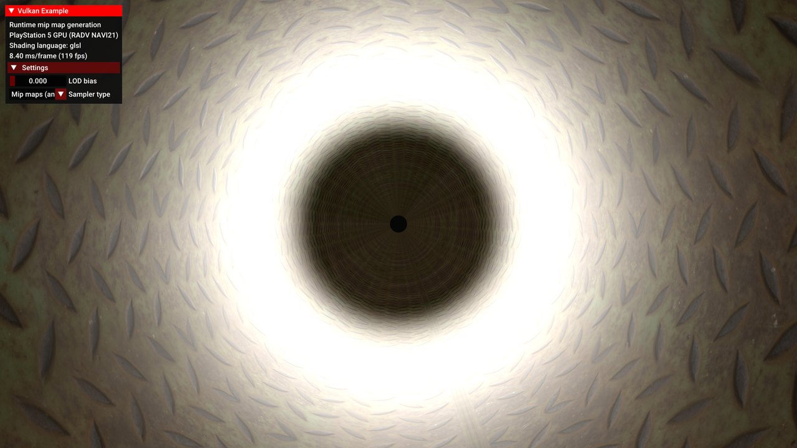</a><br><b>03 &middot; Mipmaps made at run time</b><br><sub>A texture's mip chain made with image blits, and how filtering uses it</sub></td>
<td width="50%" valign="top"><a href="examples/pbrtexture">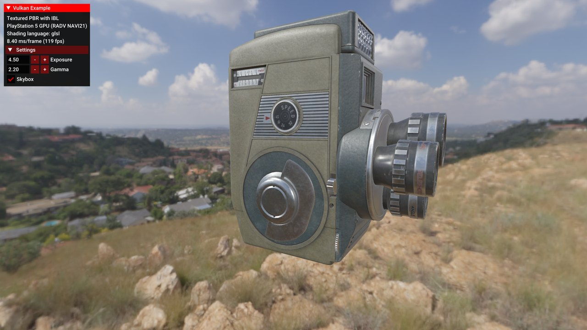</a><br><b>04 &middot; Physically based rendering</b><br><sub>Metal and roughness maps lit by an HDR environment (image based lighting)</sub></td>
</tr>
<tr>
<td width="50%" valign="top"><a href="examples/shadowmapping">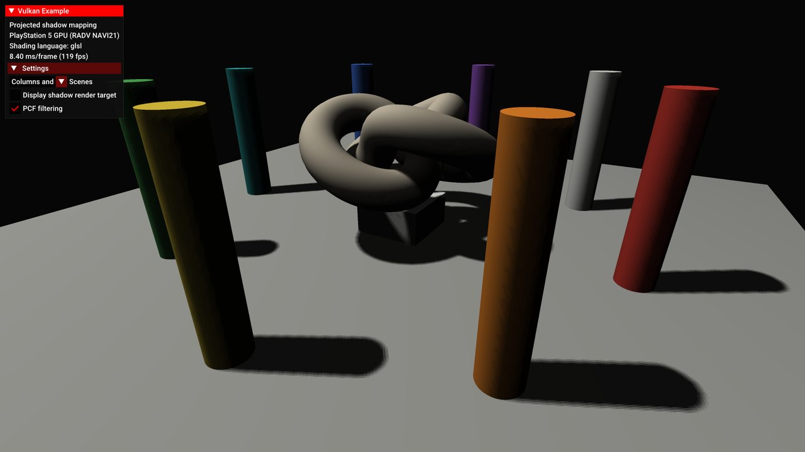</a><br><b>05 &middot; Shadow mapping</b><br><sub>A directional light's depth map, filtered with PCF</sub></td>
<td width="50%" valign="top"><a href="examples/deferred">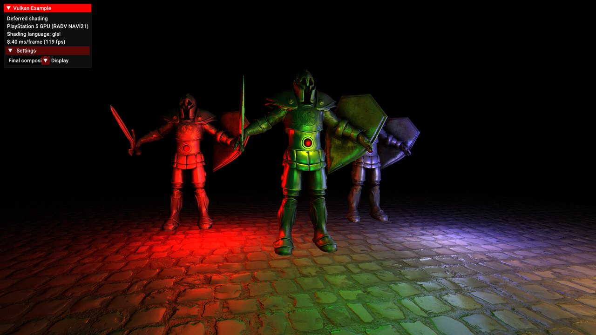</a><br><b>06 &middot; Deferred shading</b><br><sub>A G-buffer in several render targets, then many lights in one pass</sub></td>
</tr>
<tr>
<td width="50%" valign="top"><a href="examples/bloom">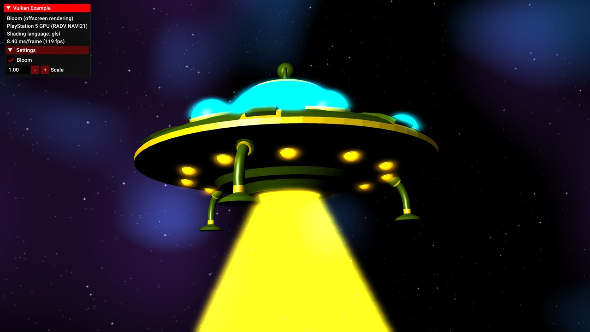</a><br><b>07 &middot; Bloom</b><br><sub>Bright parts blurred in two separable passes and added back</sub></td>
<td width="50%" valign="top"><a href="examples/multisampling">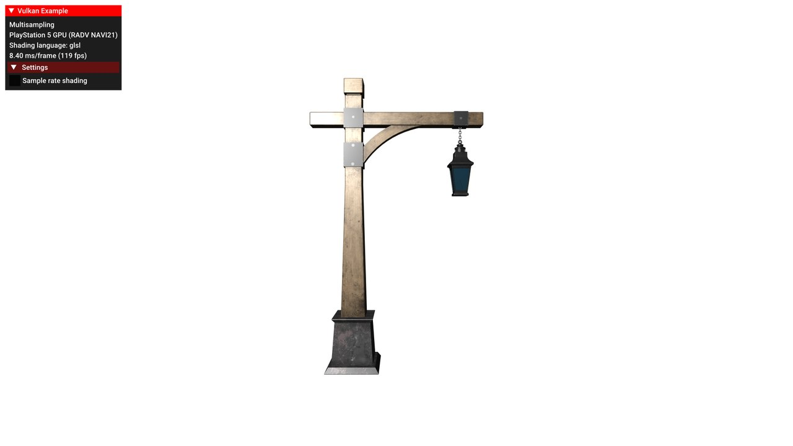</a><br><b>08 &middot; Multisampling (MSAA)</b><br><sub>Anti-aliasing with multisampled attachments resolved at the end of the pass</sub></td>
</tr>
<tr>
<td width="50%" valign="top"><a href="examples/instancing">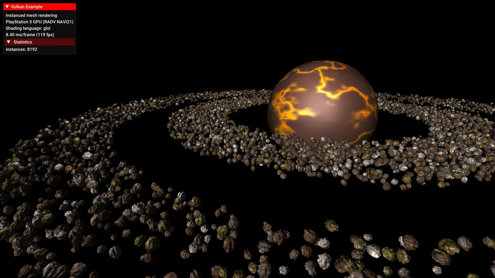</a><br><b>09 &middot; Instancing</b><br><sub>Thousands of rocks in one draw, each with data of its own</sub></td>
<td width="50%" valign="top"><a href="examples/indirectdraw">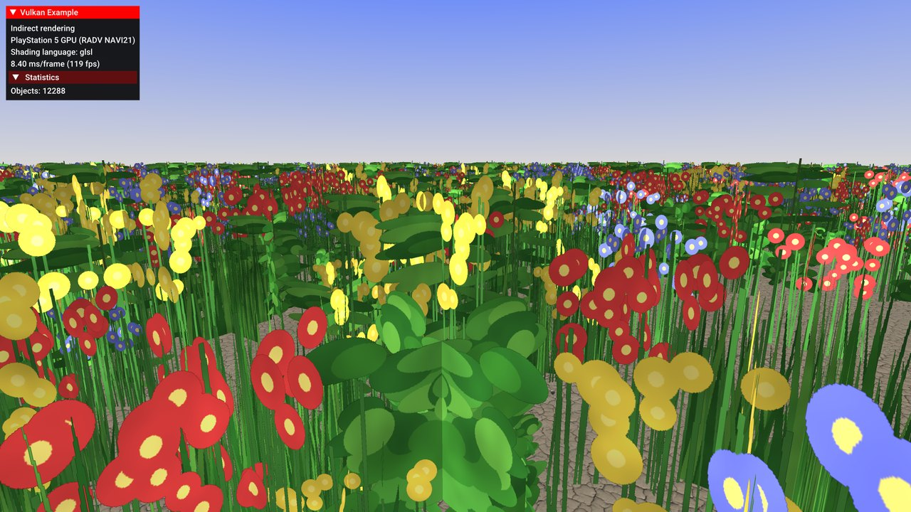</a><br><b>10 &middot; Indirect drawing</b><br><sub>Draw calls read from a GPU buffer, many meshes and instances each</sub></td>
</tr>
<tr>
<td width="50%" valign="top"><a href="examples/computeparticles">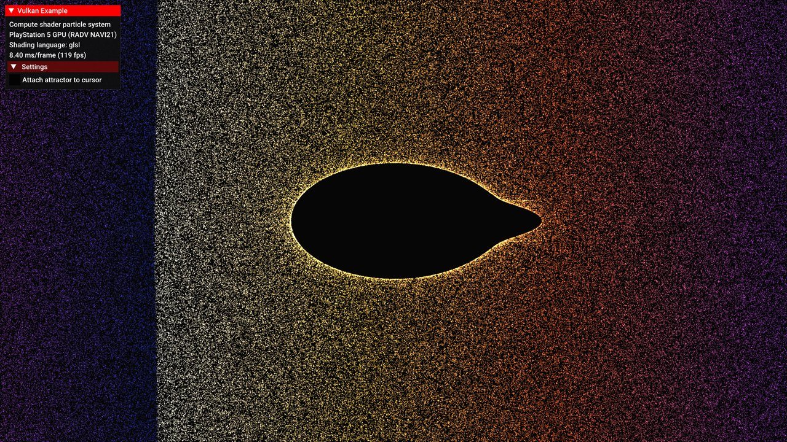</a><br><b>11 &middot; Compute particles</b><br><sub>A particle system moved by a compute shader and drawn as points</sub></td>
<td width="50%" valign="top"><a href="examples/descriptorindexing">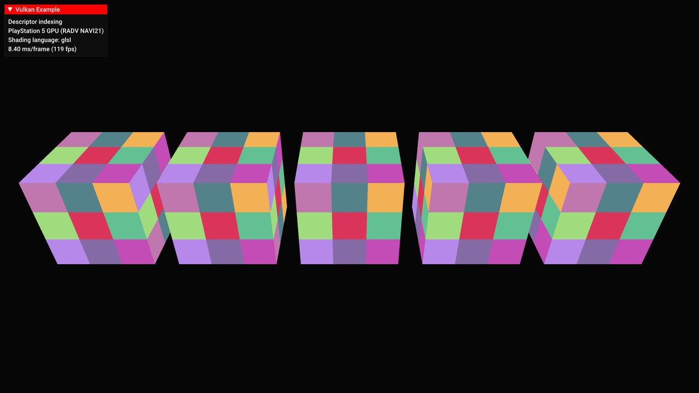</a><br><b>12 &middot; Bindless textures</b><br><sub>One descriptor array of textures, indexed per object in the shader</sub></td>
</tr>
<tr>
<td width="50%" valign="top"><a href="examples/dynamicrendering">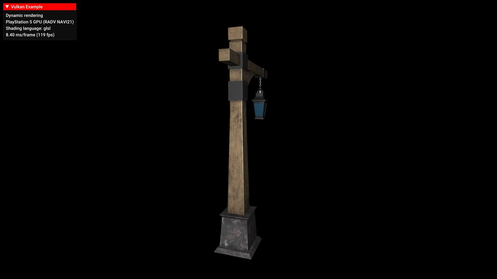</a><br><b>13 &middot; Dynamic rendering</b><br><sub>Rendering without render pass and framebuffer objects</sub></td>
<td width="50%" valign="top"><a href="examples/imgui">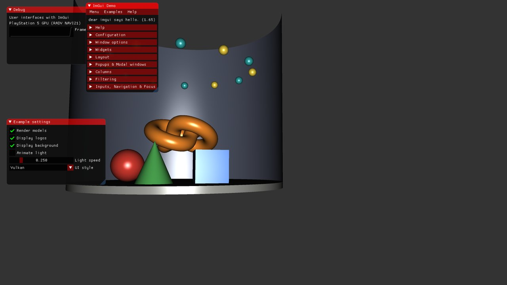</a><br><b>14 &middot; On-screen UI</b><br><sub>Dear ImGui drawn over a 3D scene, with windows of its own</sub></td>
</tr>
<tr>
<td width="50%" valign="top"><a href="examples/meshshader">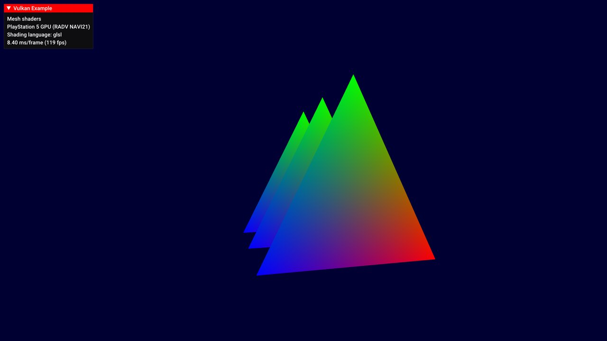</a><br><b>15 &middot; Mesh shaders</b><br><sub>Geometry made by task and mesh shaders, with no vertex input</sub></td>
<td width="50%" valign="top"><a href="examples/rayquery">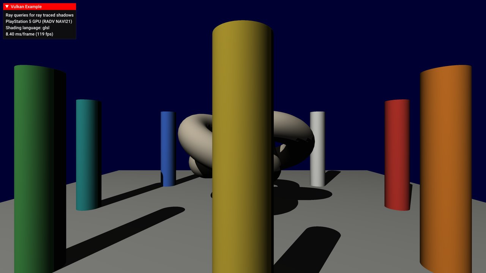</a><br><b>16 &middot; Ray queries</b><br><sub>Shadows traced against an acceleration structure from a fragment shader</sub></td>
</tr>
</table>

## The designs

Twenty-one complete screens from the UI kit, each a working program with its own
layout, palette, motion and sound, drawn by RADV on the console. In Vulkan
Template choose **Designs** and press **L1** / **R1**;
`new-title.py --ui <design>` makes a title whose face is one of them. Every
picture is a frame my console drew, through the capture card, during the kit's own
tour of the design. Click a picture for the design's clip, techniques and source.

<table>
<tr>
<td width="50%" valign="top"><a href="https://github.com/mihawk-99/PS5_VKHomebrewUI/blob/main/docs/DESIGNS.md#aurora">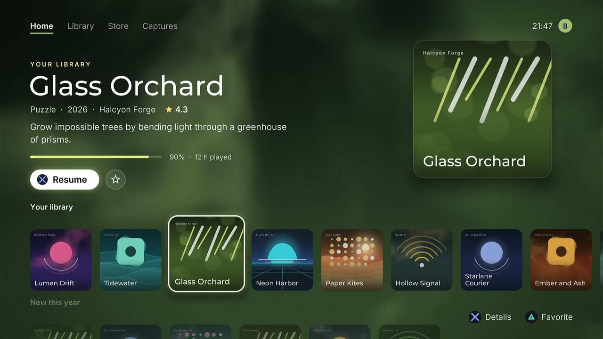</a><br><b>01 &middot; Aurora Shelf</b><br><sub>A console home screen: hero panel, cover shelves, frosted details</sub></td>
<td width="50%" valign="top"><a href="https://github.com/mihawk-99/PS5_VKHomebrewUI/blob/main/docs/DESIGNS.md#paper">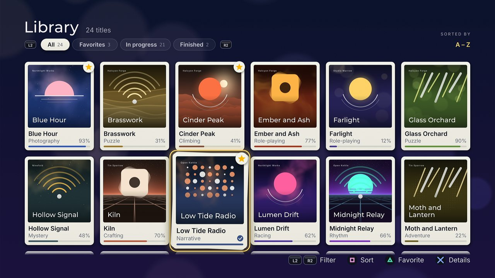</a><br><b>02 &middot; Paper Library</b><br><sub>A game shelf of paper cards that travel when sorted, filtered or picked up</sub></td>
</tr>
<tr>
<td width="50%" valign="top"><a href="https://github.com/mihawk-99/PS5_VKHomebrewUI/blob/main/docs/DESIGNS.md#neon">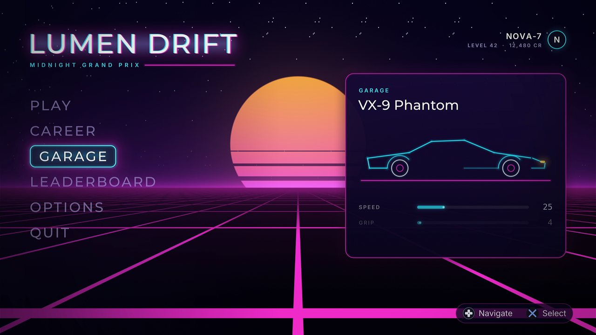</a><br><b>03 &middot; Neon Arcade</b><br><sub>A synthwave racer's main menu: neon sign, gliding tube, live previews</sub></td>
<td width="50%" valign="top"><a href="https://github.com/mihawk-99/PS5_VKHomebrewUI/blob/main/docs/DESIGNS.md#editorial">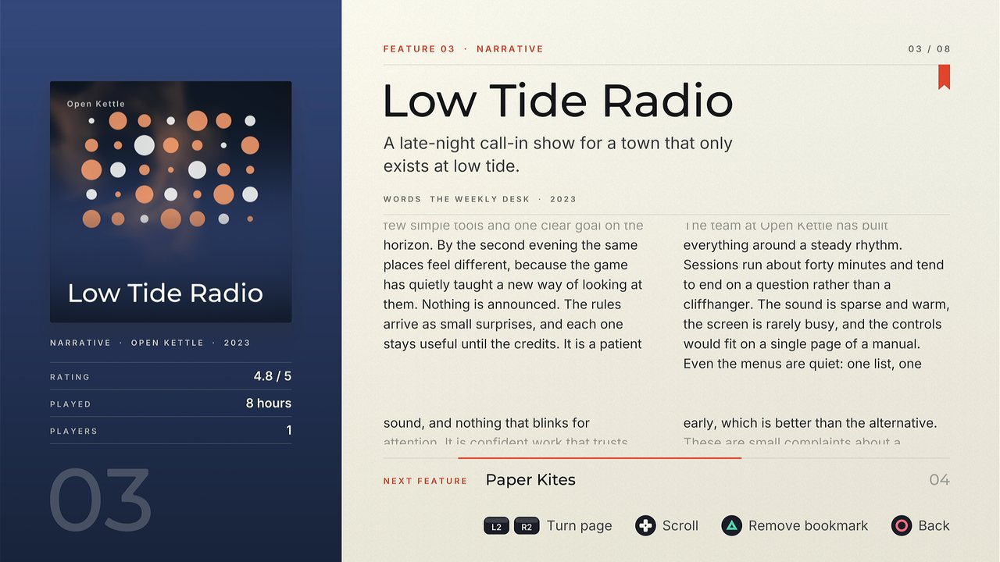</a><br><b>04 &middot; Editorial</b><br><sub>A magazine's weekly selection: big type on paper, and an article behind every row</sub></td>
</tr>
<tr>
<td width="50%" valign="top"><a href="https://github.com/mihawk-99/PS5_VKHomebrewUI/blob/main/docs/DESIGNS.md#carousel">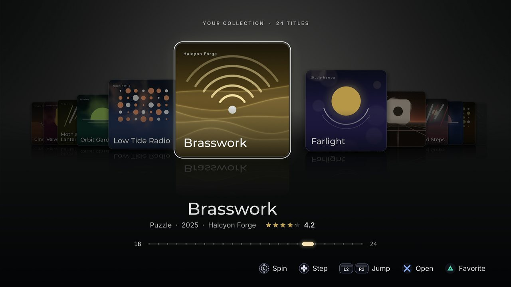</a><br><b>05 &middot; Cover Wheel</b><br><sub>A carousel with weight: scrub it, let it coast, open a cover</sub></td>
<td width="50%" valign="top"><a href="https://github.com/mihawk-99/PS5_VKHomebrewUI/blob/main/docs/DESIGNS.md#radial">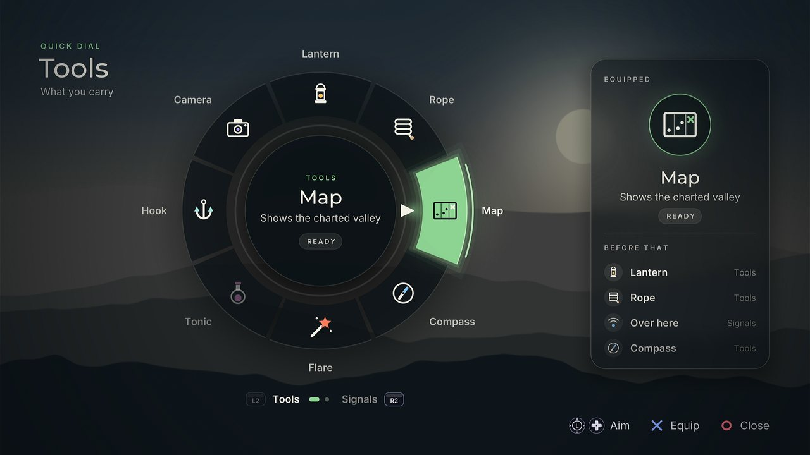</a><br><b>06 &middot; Radial Dial</b><br><sub>An in-game item wheel: aim with the stick, equip with one press</sub></td>
</tr>
<tr>
<td width="50%" valign="top"><a href="https://github.com/mihawk-99/PS5_VKHomebrewUI/blob/main/docs/DESIGNS.md#hud">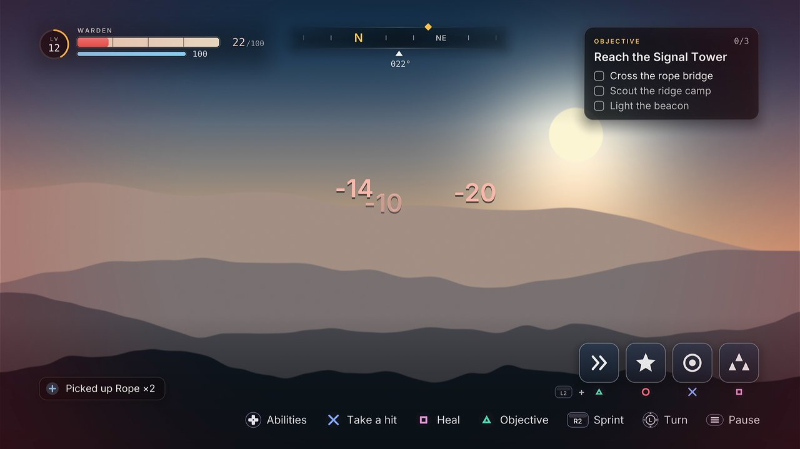</a><br><b>07 &middot; Field HUD</b><br><sub>An in-game HUD over a moving world, and the pause menu behind Options</sub></td>
<td width="50%" valign="top"><a href="https://github.com/mihawk-99/PS5_VKHomebrewUI/blob/main/docs/DESIGNS.md#dashboard">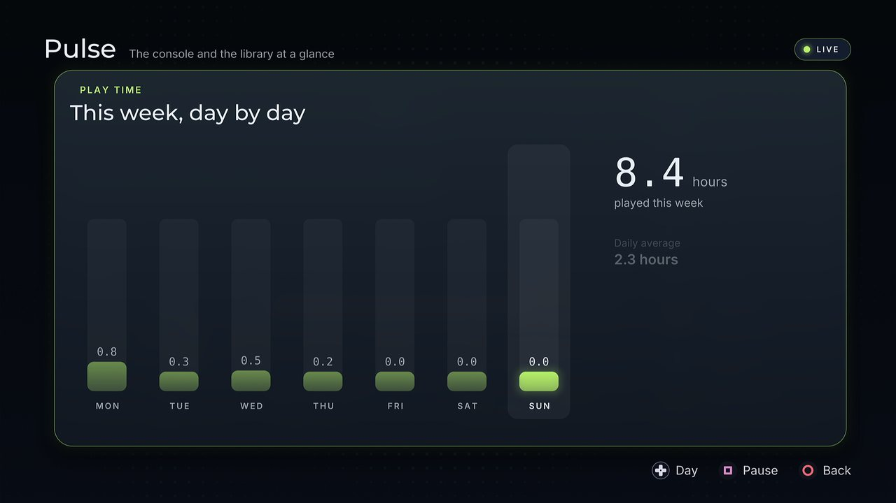</a><br><b>08 &middot; Pulse Dashboard</b><br><sub>A bento grid of live data tiles that expand into detail views</sub></td>
</tr>
<tr>
<td width="50%" valign="top"><a href="https://github.com/mihawk-99/PS5_VKHomebrewUI/blob/main/docs/DESIGNS.md#player">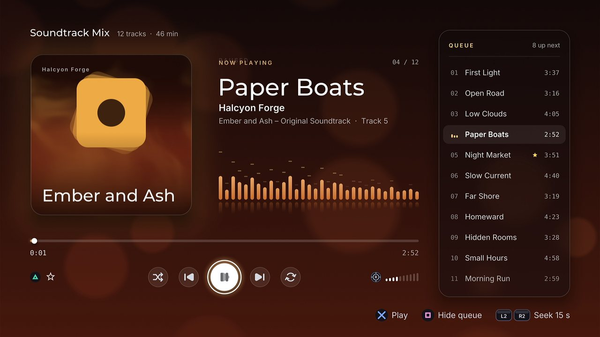</a><br><b>09 &middot; Now Playing</b><br><sub>A music player: breathing artwork, a visualizer, a scrubber and a glass queue</sub></td>
<td width="50%" valign="top"><a href="https://github.com/mihawk-99/PS5_VKHomebrewUI/blob/main/docs/DESIGNS.md#keyboard">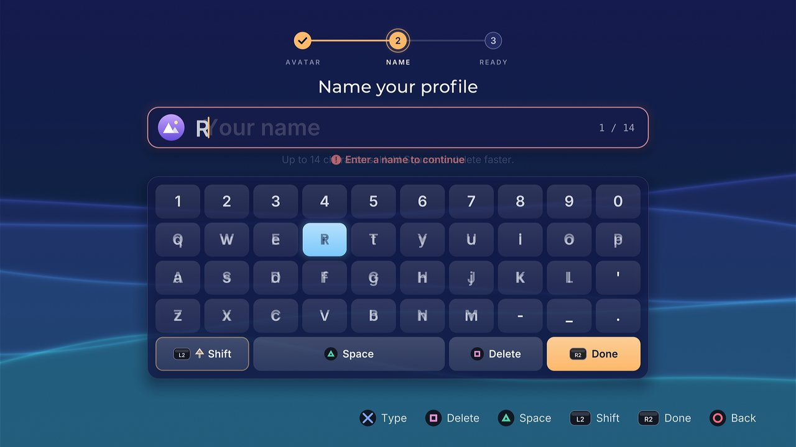</a><br><b>10 &middot; First Run</b><br><sub>A setup wizard: avatar, a name typed on a controller keyboard, a warm welcome</sub></td>
</tr>
<tr>
<td width="50%" valign="top"><a href="https://github.com/mihawk-99/PS5_VKHomebrewUI/blob/main/docs/DESIGNS.md#constellation">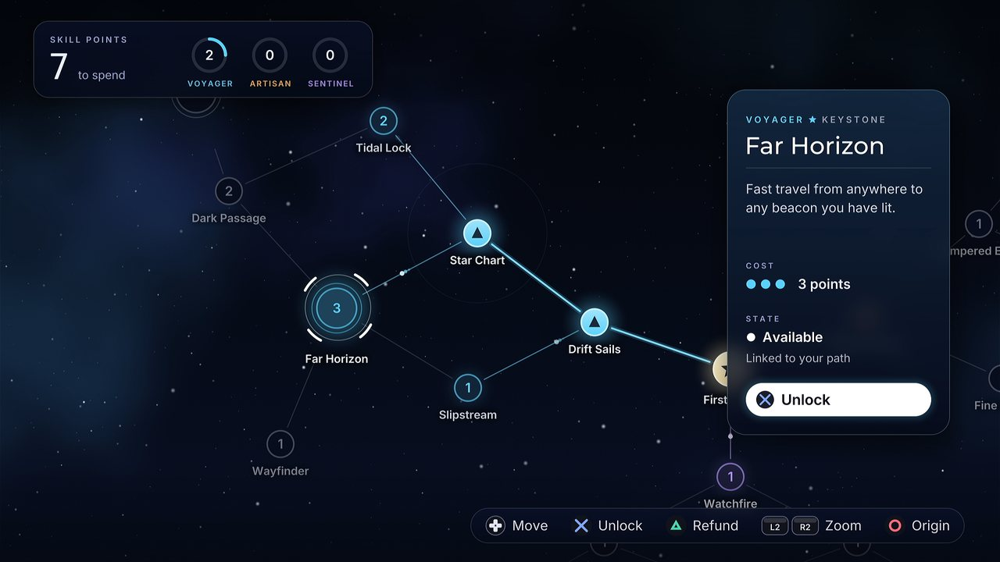</a><br><b>11 &middot; Constellation</b><br><sub>A skill tree as a star map: free 2D focus, a gliding camera, progression</sub></td>
<td width="50%" valign="top"><a href="https://github.com/mihawk-99/PS5_VKHomebrewUI/blob/main/docs/DESIGNS.md#terminal">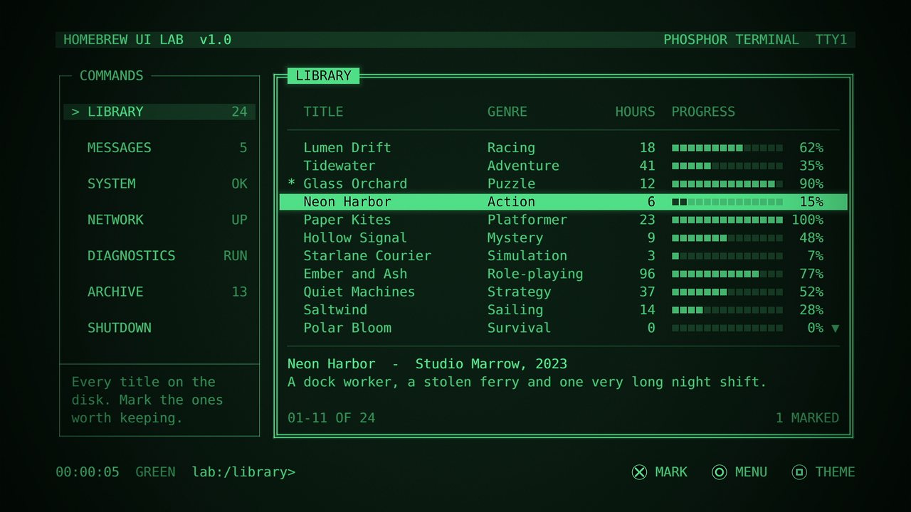</a><br><b>12 &middot; Phosphor</b><br><sub>A monochrome CRT terminal: character grid, glow, typed text</sub></td>
</tr>
<tr>
<td width="50%" valign="top"><a href="https://github.com/mihawk-99/PS5_VKHomebrewUI/blob/main/docs/DESIGNS.md#store">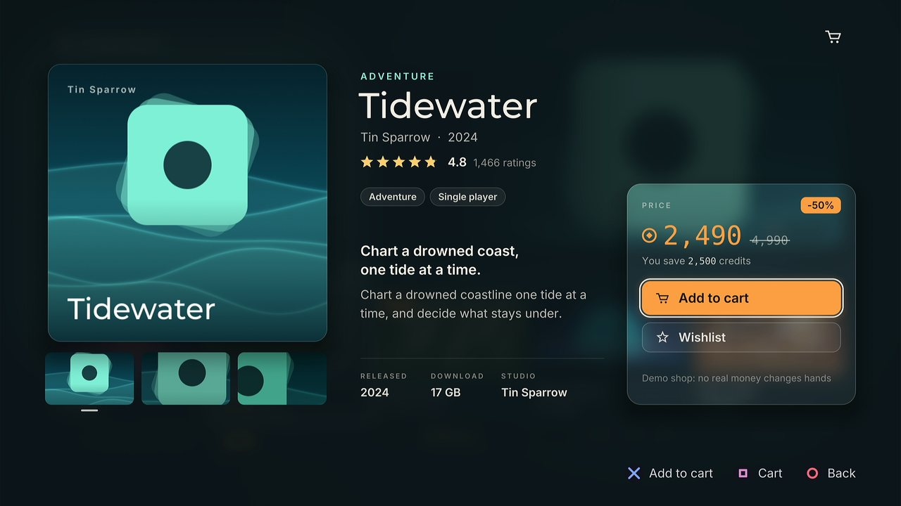</a><br><b>13 &middot; Storefront</b><br><sub>A shop window: featured banner, product pages, a cart and a checkout</sub></td>
<td width="50%" valign="top"><a href="https://github.com/mihawk-99/PS5_VKHomebrewUI/blob/main/docs/DESIGNS.md#trophies">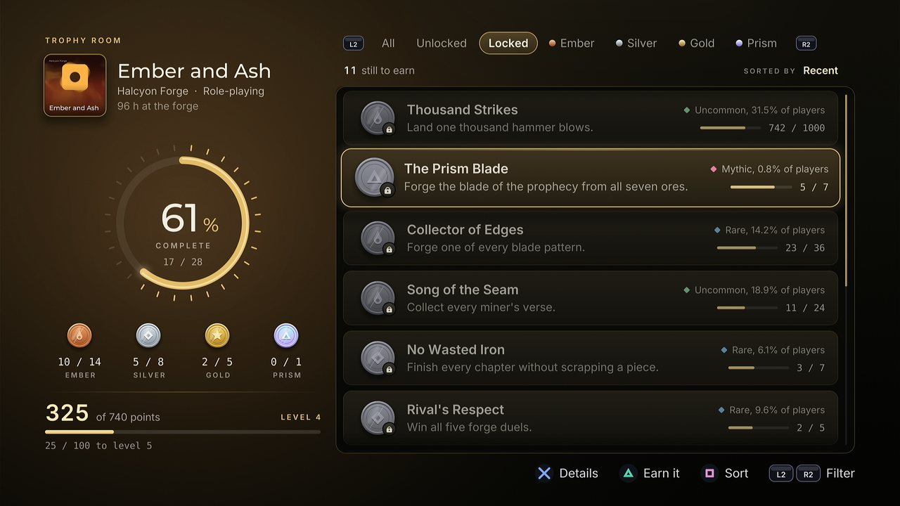</a><br><b>14 &middot; Trophy Room</b><br><sub>An achievements cabinet: metal medals, counting numbers, an unlock with ceremony</sub></td>
</tr>
<tr>
<td width="50%" valign="top"><a href="https://github.com/mihawk-99/PS5_VKHomebrewUI/blob/main/docs/DESIGNS.md#files">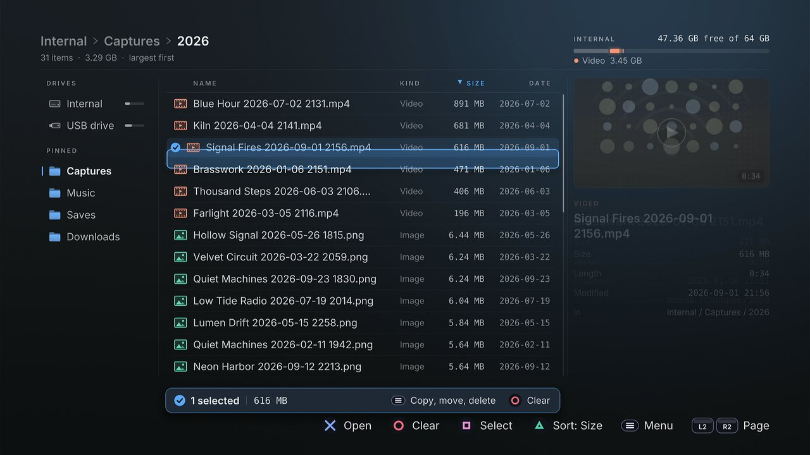</a><br><b>15 &middot; File Browser</b><br><sub>A file manager: aligned columns, folders that keep your place, visible results</sub></td>
<td width="50%" valign="top"><a href="https://github.com/mihawk-99/PS5_VKHomebrewUI/blob/main/docs/DESIGNS.md#inventory">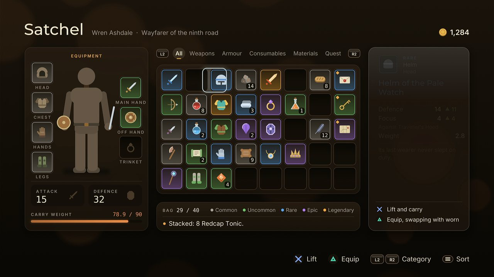</a><br><b>16 &middot; Satchel</b><br><sub>An inventory you handle: lift, carry, swap, stack and equip, with a comparing tooltip</sub></td>
</tr>
<tr>
<td width="50%" valign="top"><a href="https://github.com/mihawk-99/PS5_VKHomebrewUI/blob/main/docs/DESIGNS.md#boot">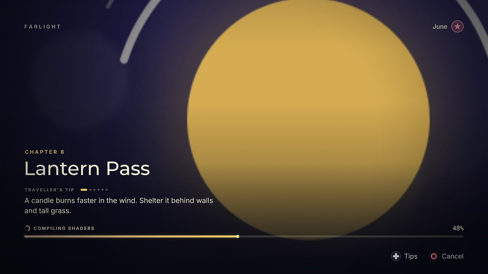</a><br><b>17 &middot; Launch Sequence</b><br><sub>Before the menu: studio splash, title, profiles and an honest loading screen</sub></td>
<td width="50%" valign="top"><a href="https://github.com/mihawk-99/PS5_VKHomebrewUI/blob/main/docs/DESIGNS.md#settings">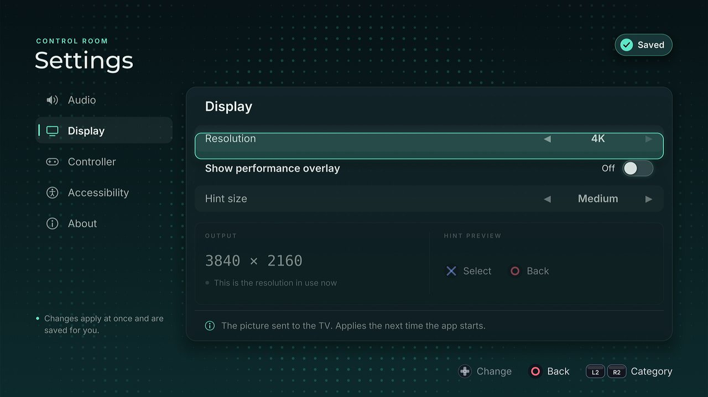</a><br><b>18 &middot; Control Room</b><br><sub>A settings screen with real controls: sliders, switches, steppers, a dialog</sub></td>
</tr>
<tr>
<td width="50%" valign="top"><a href="https://github.com/mihawk-99/PS5_VKHomebrewUI/blob/main/docs/DESIGNS.md#themes">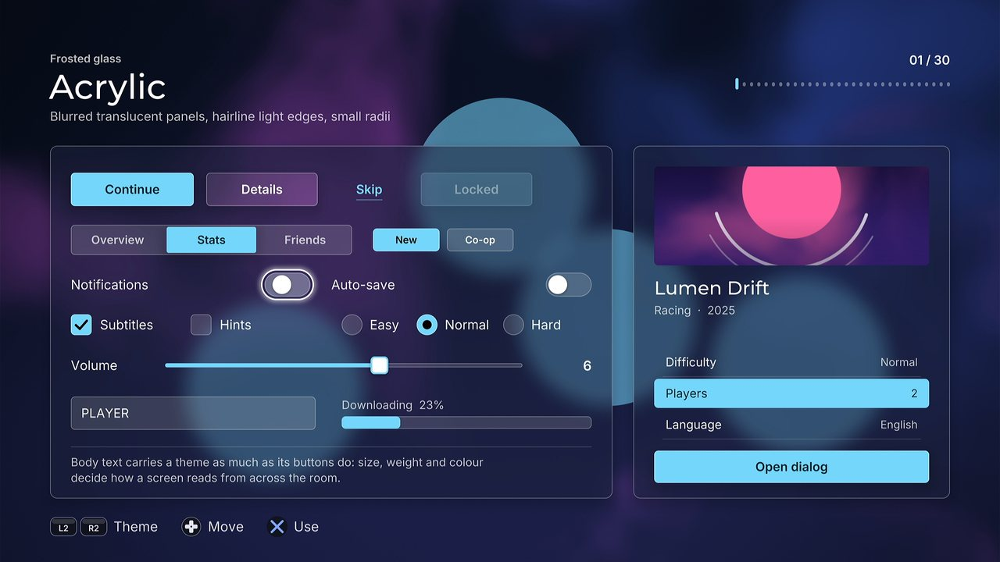</a><br><b>19 &middot; Theme Lab</b><br><sub>One screen in thirty design languages: L2 and R2 restyle every widget</sub></td>
<td width="50%" valign="top"><a href="https://github.com/mihawk-99/PS5_VKHomebrewUI/blob/main/docs/DESIGNS.md#components">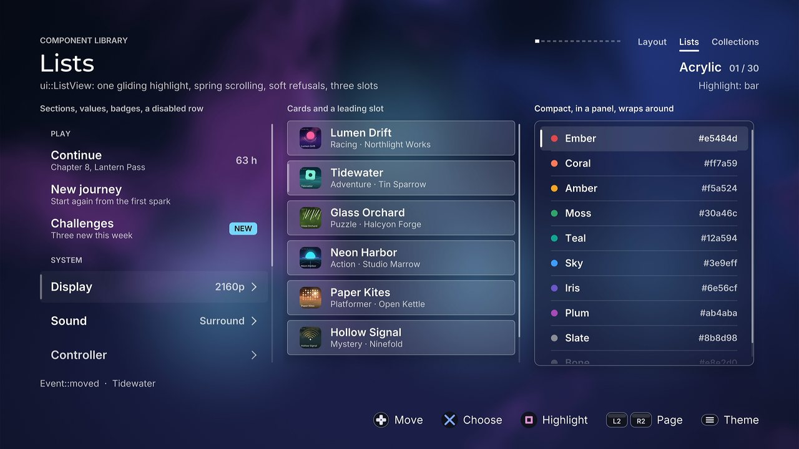</a><br><b>20 &middot; Component Library</b><br><sub>Reusable lists, grids, dialogs, forms and indicators, restyled by thirty themes</sub></td>
</tr>
<tr>
<td width="50%" valign="top"><a href="https://github.com/mihawk-99/PS5_VKHomebrewUI/blob/main/docs/DESIGNS.md#toolbox">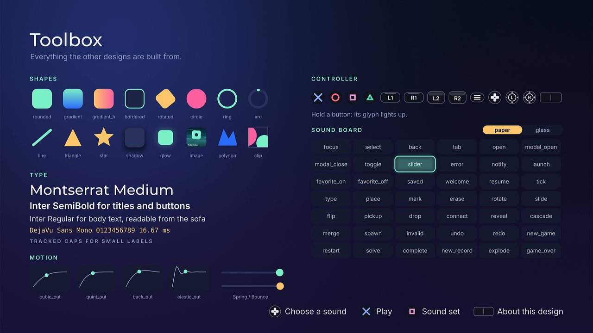</a><br><b>21 &middot; Toolbox</b><br><sub>The kit on one screen: shapes, type, motion, glyphs and every sound</sub></td>
</tr>
</table>

## The themes

The same working screen in thirty design languages: Vulkan Template's **Themes**,
where the theme you pick dresses the start screen, the Samples menu and the
samples' settings windows. Ten are styles in their own right; twenty are
modelled on well-known web frameworks. Every picture is a frame my console drew,
through the capture card.

<table>
<tr>
<td width="33%" valign="top"><a href="https://github.com/mihawk-99/PS5_VKHomebrewUI/blob/main/docs/THEMES.md#acrylic">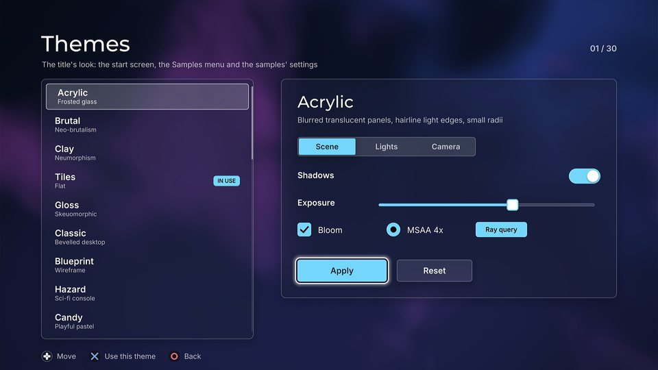</a><br><b>01 &middot; Acrylic</b><br><sub>Frosted glass</sub></td>
<td width="33%" valign="top"><a href="https://github.com/mihawk-99/PS5_VKHomebrewUI/blob/main/docs/THEMES.md#brutal">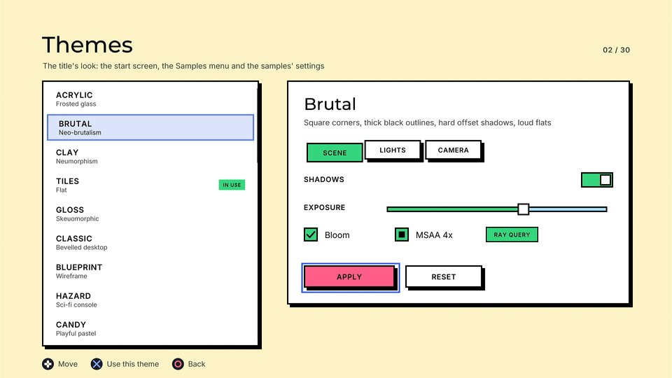</a><br><b>02 &middot; Brutal</b><br><sub>Neo-brutalism</sub></td>
<td width="33%" valign="top"><a href="https://github.com/mihawk-99/PS5_VKHomebrewUI/blob/main/docs/THEMES.md#clay">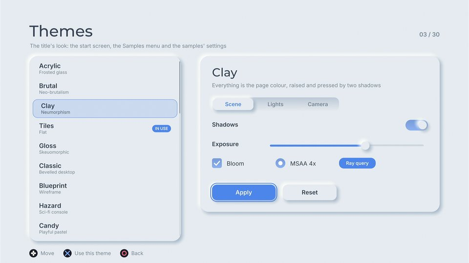</a><br><b>03 &middot; Clay</b><br><sub>Neumorphism</sub></td>
</tr>
<tr>
<td width="33%" valign="top"><a href="https://github.com/mihawk-99/PS5_VKHomebrewUI/blob/main/docs/THEMES.md#tiles">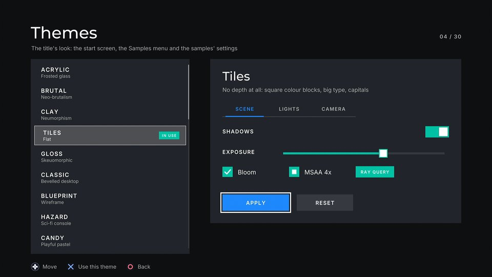</a><br><b>04 &middot; Tiles</b><br><sub>Flat</sub></td>
<td width="33%" valign="top"><a href="https://github.com/mihawk-99/PS5_VKHomebrewUI/blob/main/docs/THEMES.md#gloss">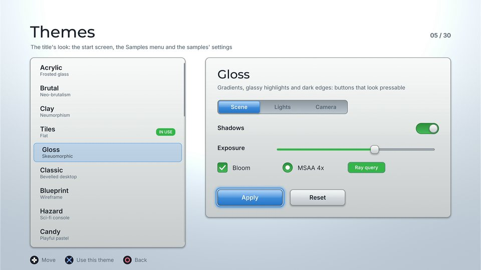</a><br><b>05 &middot; Gloss</b><br><sub>Skeuomorphic</sub></td>
<td width="33%" valign="top"><a href="https://github.com/mihawk-99/PS5_VKHomebrewUI/blob/main/docs/THEMES.md#classic">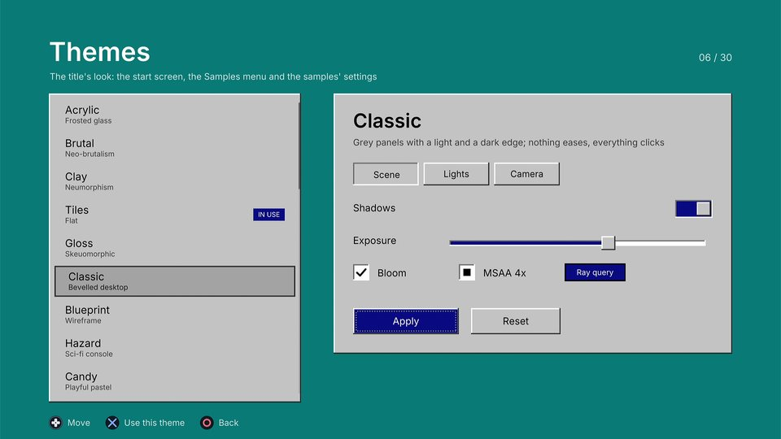</a><br><b>06 &middot; Classic</b><br><sub>Bevelled desktop</sub></td>
</tr>
<tr>
<td width="33%" valign="top"><a href="https://github.com/mihawk-99/PS5_VKHomebrewUI/blob/main/docs/THEMES.md#blueprint">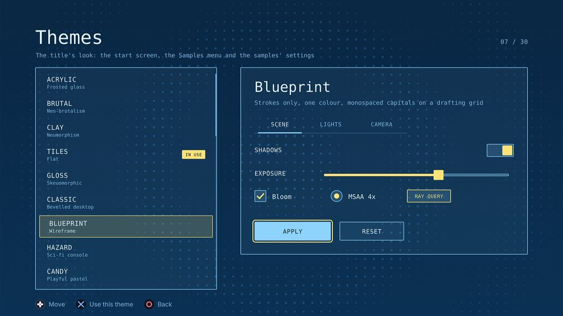</a><br><b>07 &middot; Blueprint</b><br><sub>Wireframe</sub></td>
<td width="33%" valign="top"><a href="https://github.com/mihawk-99/PS5_VKHomebrewUI/blob/main/docs/THEMES.md#hazard">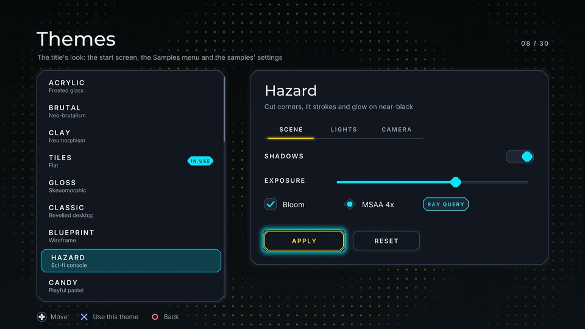</a><br><b>08 &middot; Hazard</b><br><sub>Sci-fi console</sub></td>
<td width="33%" valign="top"><a href="https://github.com/mihawk-99/PS5_VKHomebrewUI/blob/main/docs/THEMES.md#candy">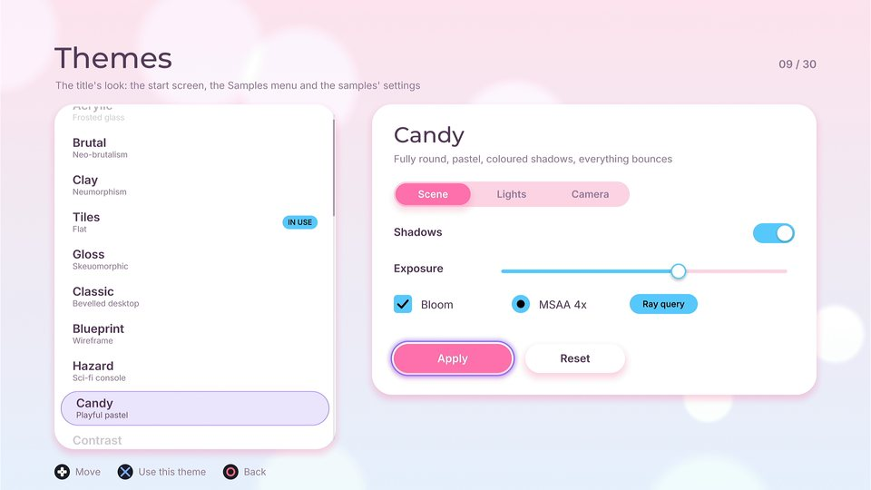</a><br><b>09 &middot; Candy</b><br><sub>Playful pastel</sub></td>
</tr>
<tr>
<td width="33%" valign="top"><a href="https://github.com/mihawk-99/PS5_VKHomebrewUI/blob/main/docs/THEMES.md#contrast">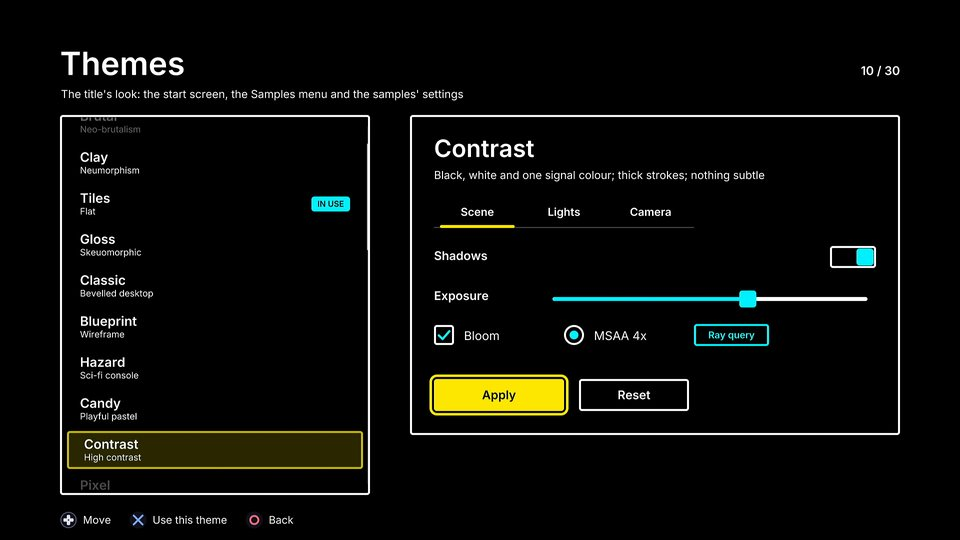</a><br><b>10 &middot; Contrast</b><br><sub>High contrast</sub></td>
<td width="33%" valign="top"><a href="https://github.com/mihawk-99/PS5_VKHomebrewUI/blob/main/docs/THEMES.md#pixel">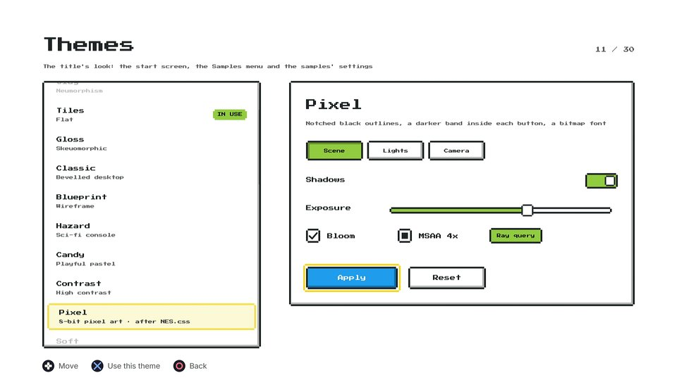</a><br><b>11 &middot; Pixel</b><br><sub>8-bit pixel art &middot; after NES.css</sub></td>
<td width="33%" valign="top"><a href="https://github.com/mihawk-99/PS5_VKHomebrewUI/blob/main/docs/THEMES.md#soft">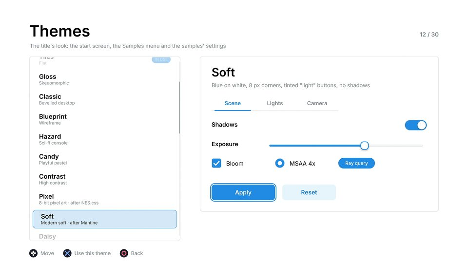</a><br><b>12 &middot; Soft</b><br><sub>Modern soft &middot; after Mantine</sub></td>
</tr>
<tr>
<td width="33%" valign="top"><a href="https://github.com/mihawk-99/PS5_VKHomebrewUI/blob/main/docs/THEMES.md#daisy">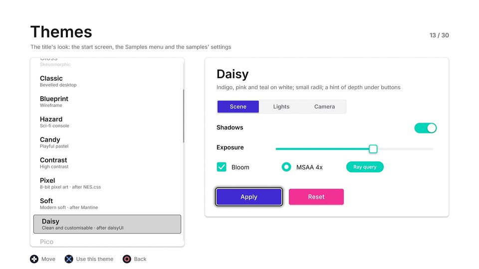</a><br><b>13 &middot; Daisy</b><br><sub>Clean and customisable &middot; after daisyUI</sub></td>
<td width="33%" valign="top"><a href="https://github.com/mihawk-99/PS5_VKHomebrewUI/blob/main/docs/THEMES.md#pico">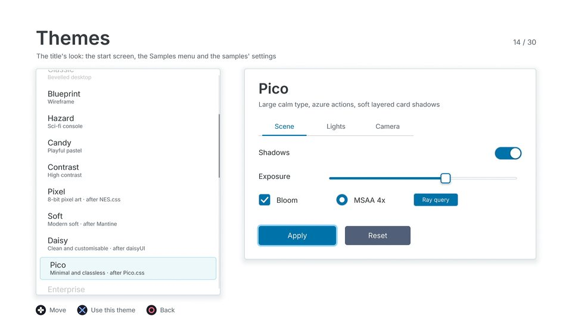</a><br><b>14 &middot; Pico</b><br><sub>Minimal and classless &middot; after Pico.css</sub></td>
<td width="33%" valign="top"><a href="https://github.com/mihawk-99/PS5_VKHomebrewUI/blob/main/docs/THEMES.md#ant">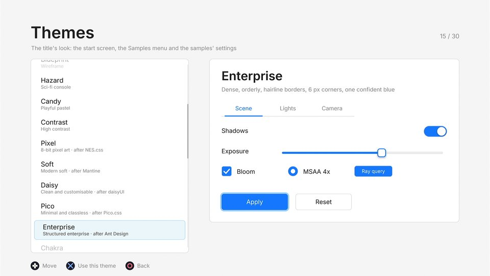</a><br><b>15 &middot; Enterprise</b><br><sub>Structured enterprise &middot; after Ant Design</sub></td>
</tr>
<tr>
<td width="33%" valign="top"><a href="https://github.com/mihawk-99/PS5_VKHomebrewUI/blob/main/docs/THEMES.md#chakra">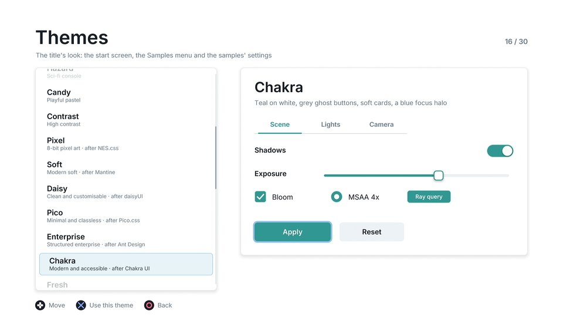</a><br><b>16 &middot; Chakra</b><br><sub>Modern and accessible &middot; after Chakra UI</sub></td>
<td width="33%" valign="top"><a href="https://github.com/mihawk-99/PS5_VKHomebrewUI/blob/main/docs/THEMES.md#fresh">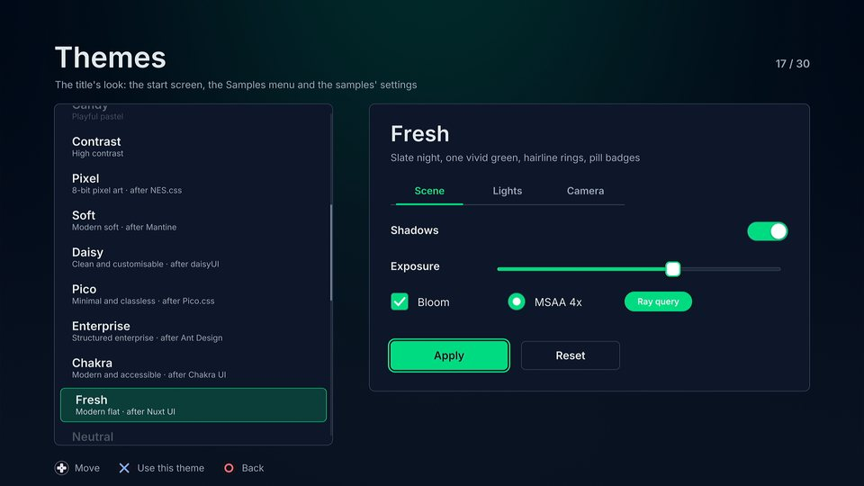</a><br><b>17 &middot; Fresh</b><br><sub>Modern flat &middot; after Nuxt UI</sub></td>
<td width="33%" valign="top"><a href="https://github.com/mihawk-99/PS5_VKHomebrewUI/blob/main/docs/THEMES.md#neutral">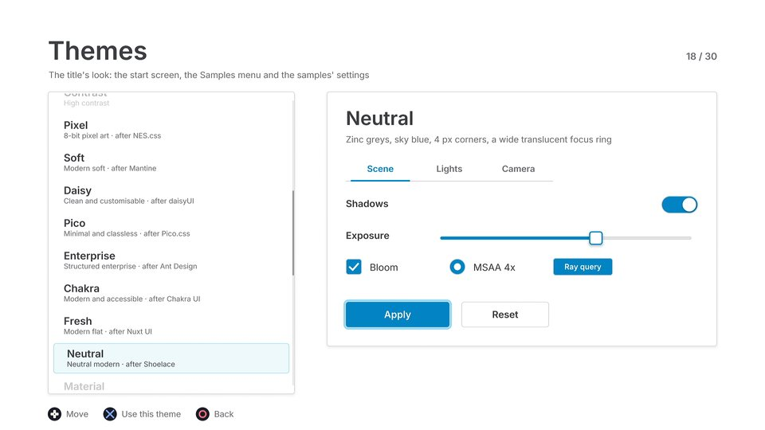</a><br><b>18 &middot; Neutral</b><br><sub>Neutral modern &middot; after Shoelace</sub></td>
</tr>
<tr>
<td width="33%" valign="top"><a href="https://github.com/mihawk-99/PS5_VKHomebrewUI/blob/main/docs/THEMES.md#paper">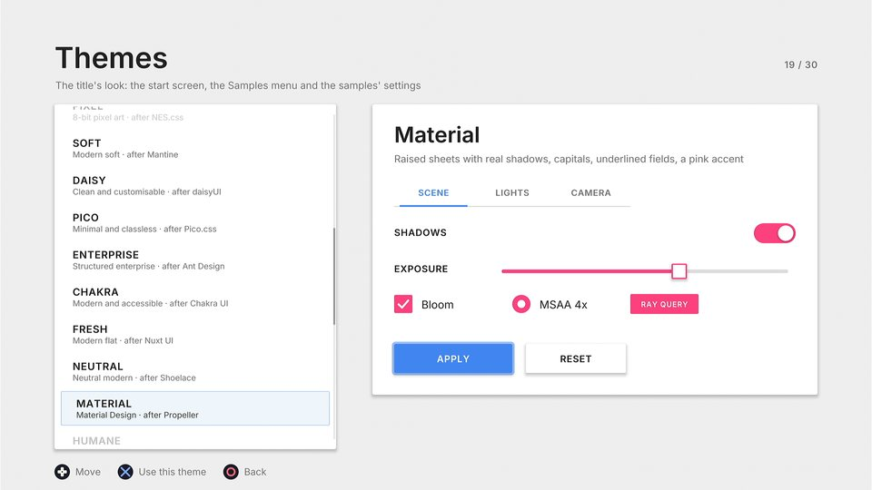</a><br><b>19 &middot; Material</b><br><sub>Material Design &middot; after Propeller</sub></td>
<td width="33%" valign="top"><a href="https://github.com/mihawk-99/PS5_VKHomebrewUI/blob/main/docs/THEMES.md#humane">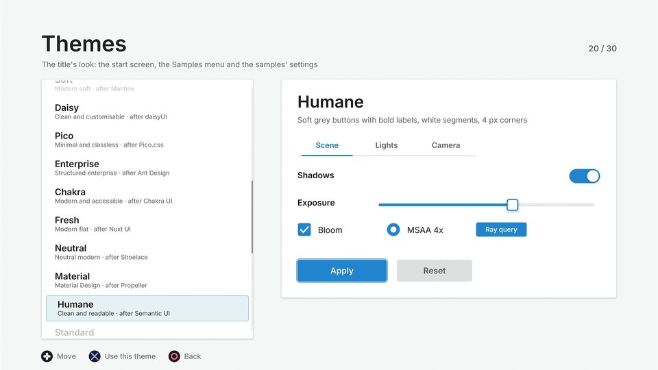</a><br><b>20 &middot; Humane</b><br><sub>Clean and readable &middot; after Semantic UI</sub></td>
<td width="33%" valign="top"><a href="https://github.com/mihawk-99/PS5_VKHomebrewUI/blob/main/docs/THEMES.md#standard">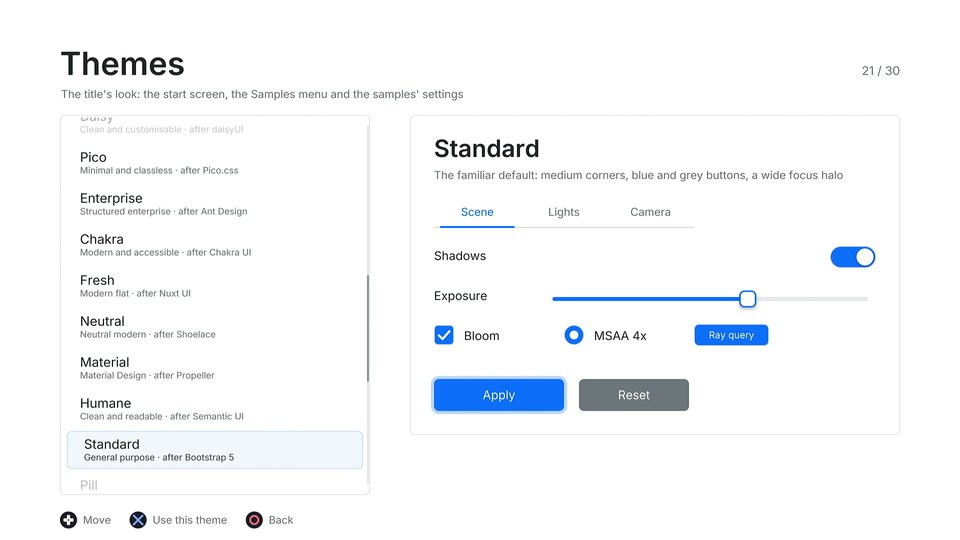</a><br><b>21 &middot; Standard</b><br><sub>General purpose &middot; after Bootstrap 5</sub></td>
</tr>
<tr>
<td width="33%" valign="top"><a href="https://github.com/mihawk-99/PS5_VKHomebrewUI/blob/main/docs/THEMES.md#pill">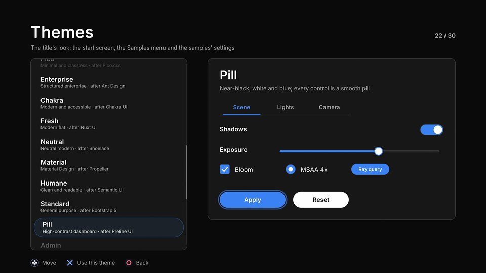</a><br><b>22 &middot; Pill</b><br><sub>High-contrast dashboard &middot; after Preline UI</sub></td>
<td width="33%" valign="top"><a href="https://github.com/mihawk-99/PS5_VKHomebrewUI/blob/main/docs/THEMES.md#admin">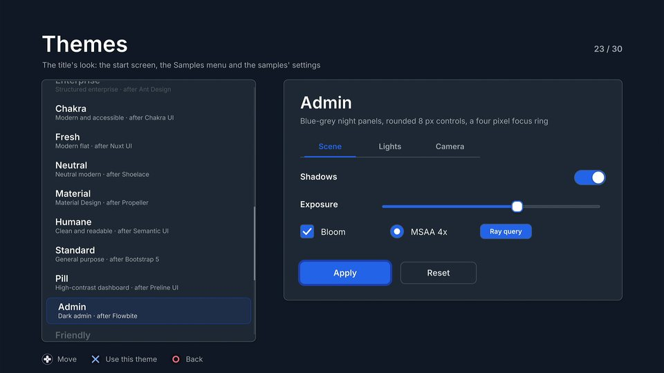</a><br><b>23 &middot; Admin</b><br><sub>Dark admin &middot; after Flowbite</sub></td>
<td width="33%" valign="top"><a href="https://github.com/mihawk-99/PS5_VKHomebrewUI/blob/main/docs/THEMES.md#friendly">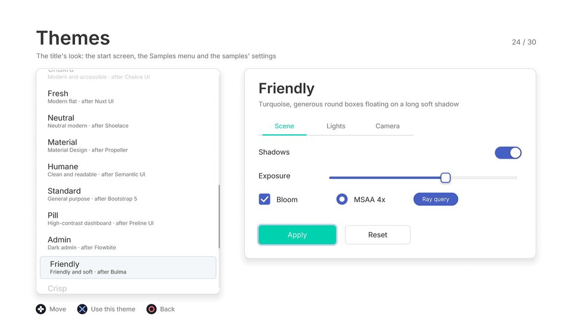</a><br><b>24 &middot; Friendly</b><br><sub>Friendly and soft &middot; after Bulma</sub></td>
</tr>
<tr>
<td width="33%" valign="top"><a href="https://github.com/mihawk-99/PS5_VKHomebrewUI/blob/main/docs/THEMES.md#crisp">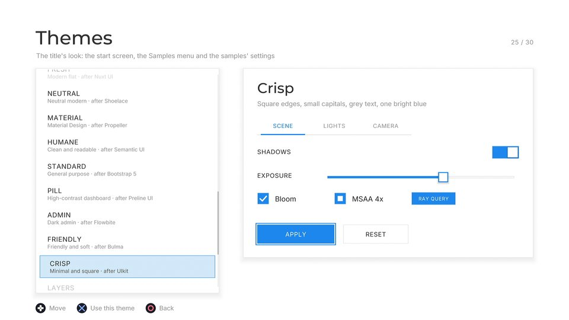</a><br><b>25 &middot; Crisp</b><br><sub>Minimal and square &middot; after UIkit</sub></td>
<td width="33%" valign="top"><a href="https://github.com/mihawk-99/PS5_VKHomebrewUI/blob/main/docs/THEMES.md#layers">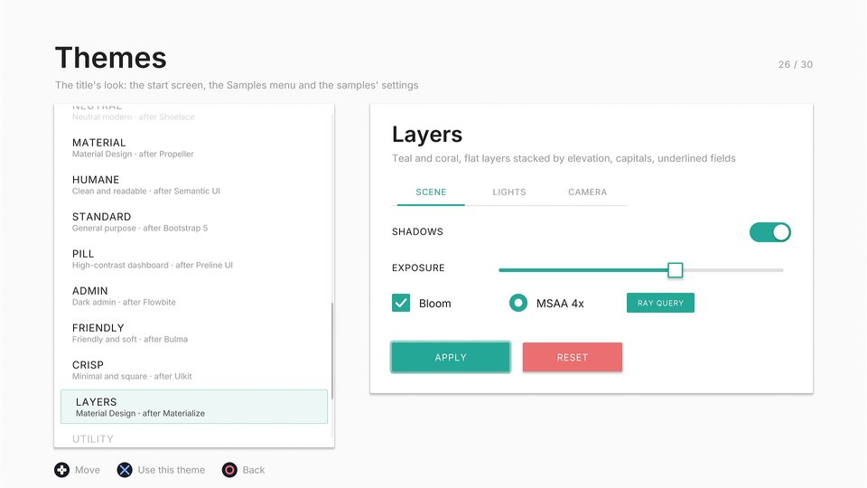</a><br><b>26 &middot; Layers</b><br><sub>Material Design &middot; after Materialize</sub></td>
<td width="33%" valign="top"><a href="https://github.com/mihawk-99/PS5_VKHomebrewUI/blob/main/docs/THEMES.md#utility">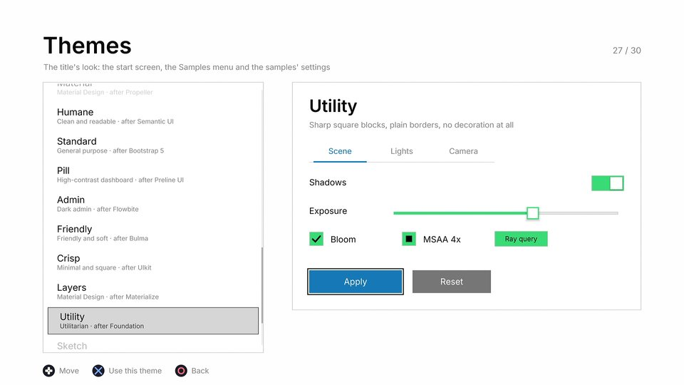</a><br><b>27 &middot; Utility</b><br><sub>Utilitarian &middot; after Foundation</sub></td>
</tr>
<tr>
<td width="33%" valign="top"><a href="https://github.com/mihawk-99/PS5_VKHomebrewUI/blob/main/docs/THEMES.md#sketch">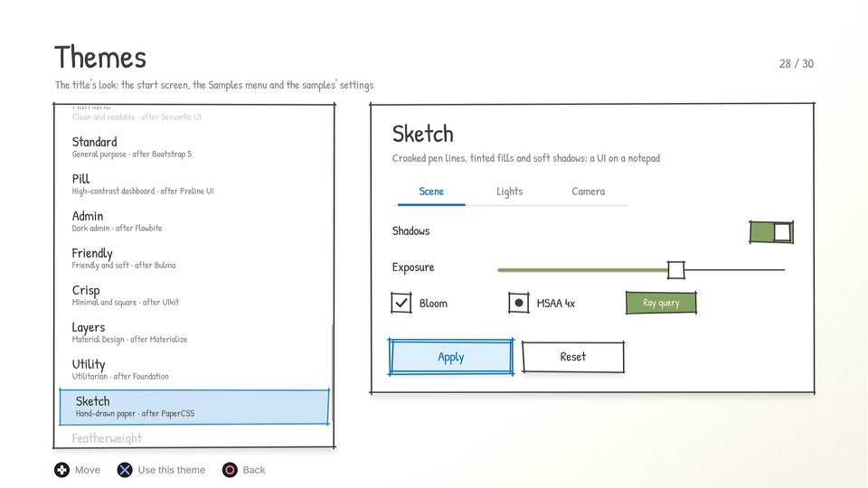</a><br><b>28 &middot; Sketch</b><br><sub>Hand-drawn paper &middot; after PaperCSS</sub></td>
<td width="33%" valign="top"><a href="https://github.com/mihawk-99/PS5_VKHomebrewUI/blob/main/docs/THEMES.md#light">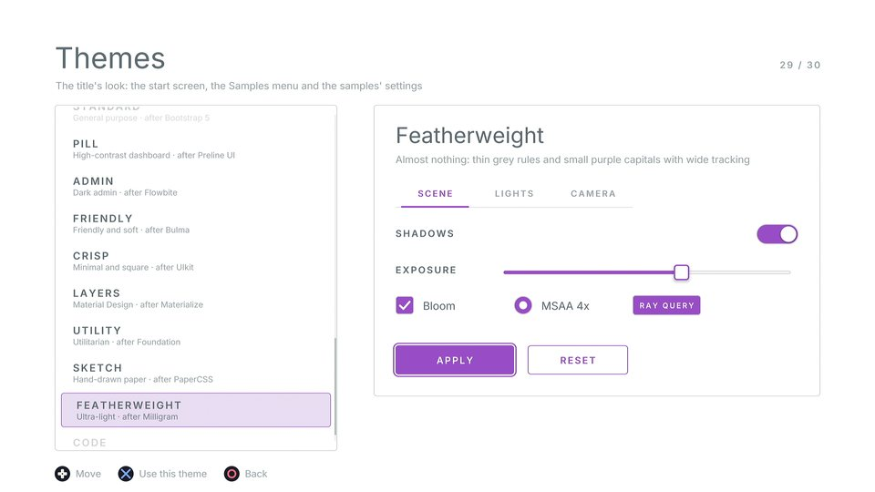</a><br><b>29 &middot; Featherweight</b><br><sub>Ultra-light &middot; after Milligram</sub></td>
<td width="33%" valign="top"><a href="https://github.com/mihawk-99/PS5_VKHomebrewUI/blob/main/docs/THEMES.md#code">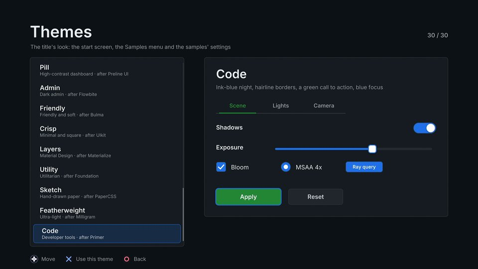</a><br><b>30 &middot; Code</b><br><sub>Developer tools &middot; after Primer</sub></td>
</tr>
</table>

## Quick start

On a Linux PC (Arch or CachyOS are what I use), beside an empty folder for the
stack:

```bash
git clone https://github.com/mihawk-99/PS5_VulkanTemplate.git
cd PS5_VulkanTemplate
ps5/tools/bootstrap.sh --check     # what the host has, and what is missing
ps5/tools/bootstrap.sh             # clone PS5_Vulkan, PS5_Mesa, PS5_PayloadSDK beside it, build what is missing
printf 'PS5_HOST=<the console'"'"'s address>\n' >> ../PS5_Vulkan/.env
```

The bootstrap builds RADV once (a long build), PS5_Vulkan's native tool and
`libc.prx`, the console's control payload, installs the pinned payload SDK and
fetches glm. It never touches the console.

**The console** needs a homebrew environment of its own (this repository does not
set one up): an enabler such as [etaHEN](https://github.com/etaHEN/etaHEN),
[ShadowMountPlus](https://github.com/drakmor/ShadowMountPlus) for titles in
`/data/homebrew`, [ftpsrv](https://github.com/ps5-payload-dev/ftpsrv) on port 2121
and [klogsrv](https://github.com/ps5-payload-dev/klogsrv) on port 3232. Once per
boot, load PS5_Vulkan's control payload, which launches and stops titles for the
tools:

```bash
(cd ../PS5_Vulkan && python3 tools/ps5_console.py deploy-payload)
# then load it on the console with the console's payload loader
```

| On the console | Does |
| --- | --- |
| **Samples** | The menu of Vulkan samples: the D-pad moves, **CROSS** starts one, **OPTIONS** comes back |
| **Designs** | The kit's gallery: **L1** / **R1** switch designs, **OPTIONS** held for a second comes back |
| **Themes** | The title's look: **CROSS** uses the theme in focus |
| **CIRCLE** | Back to the start screen, from each |

## Make a homebrew

```bash
python3 ps5/tools/new-title.py ../PS5_MyGame --title-id PPSA99121 --name "My Game"
python3 ps5/tools/new-title.py ../PS5_MyApp --title-id PPSA99122 --name "My App" --ui neon   # a title whose face is a design
cd ../PS5_MyGame
ps5/tools/build.sh && ps5/tools/deploy.sh && ps5/tools/run.sh
```

The new title is the foundation with one program, `examples/mygame/mygame.cpp`,
grown from the starter: a textured, lit glTF model, a camera on the sticks, a
settings window on the pad. With `--ui <design>` the program is the UI starter and
its screen is the title's own copy of the design, to change at will. Launched from
the home screen the title starts at once; `ps5/tools/run.sh` runs it for 300
frames, brings its last frame back and checks klog. The title id is `PPSA` and
five digits, unique on the console; the generator refuses those my titles use.

## Use it

- **Grow a title.** Replace the model, grow the class, and take whatever a sample
  shows: every sample is a class on the same base.
- **Give it a face.** Start from a design with `--ui`, or draw your own screens
  with the kit's components and themes ([`ps5/ui/README.md`](ps5/ui/README.md)).
- **Test it on the console.** `ps5/tools/run.sh` gives a verdict per program and
  keeps every last frame; `ps5/tools/host-reference.sh` draws the same frames on
  the PC's driver for comparison.
- **Work with an agent.** Link the skills into the agent's skill folder and it
  knows the stack:

```bash
for skill in ps5-homebrew ps5-console ps5-porting ps5-release; do
    ln -sfn "$PWD/skills/$skill" ~/.claude/skills/$skill
done
```

## Documentation

| Guide | Covers |
| --- | --- |
| [ps5/README.md](ps5/README.md) | How the port works: the build, the tools, the test runs, adding a sample, and what each sample measured |
| [ps5/ui/README.md](ps5/ui/README.md) | The UI module: its licence, its files, a program that draws with the kit, moving the pin |
| [AGENTS.md](AGENTS.md) | For AI coding agents: the rules, the tasks step by step, the console's facts, the pitfalls already paid for |
| [skills/ps5-homebrew](skills/ps5-homebrew/SKILL.md) | Making and building a title: the stack, Vulkan on RADV, the platform's contracts, packaging, the UI kit |
| [skills/ps5-console](skills/ps5-console/SKILL.md) | Everything that touches the console: deploying, launching, klog, test runs, reading crashes |
| [skills/ps5-porting](skills/ps5-porting/SKILL.md) | Bringing existing software over: forks, memory and JIT, files, loading code without `dlopen` |
| [skills/ps5-release](skills/ps5-release/SKILL.md) | What leaves the machine: licences, notices, release notes |
| [ps5/ASSETS.md](ps5/ASSETS.md) | Every asset a title ships, with its author, licence and source |
| [README.upstream.md](README.upstream.md) | Sascha Willems' README: the examples and their credits |

## Validated on hardware

Validated on my console on 2026-10-03: `ps5/tools/run.sh start launcher all` ran
the start screen, the Samples menu, Themes, the sixteen samples, the twenty-one
designs, the UI over a game and the UI starter. **43 of 43 passed**: every
program held 119.9 frames per second at 3840 x 2160, every last frame was within
0.2 to 4.5 levels in 255 of the same frame on my PC's driver, klog had no crash
record, GPU fault or driver error, and the title exited on its own. Numbers per
program are in [`ps5/README.md`](ps5/README.md).

Not verified by a person yet: how the kit's sounds and rumble feel with a
controller in hand (the test runs ignore the pad).

## Repository layout

```
base/              Sascha Willems' example base class, with the PS5 hooks (VK_EXAMPLE_PS5)
examples/          upstream's examples; the sixteen in ps5/src/samples.cpp build for the console,
                   examples/starter/ is the one new titles grow from, uikit/uioverlay/uiscreen draw with the kit
shaders/glsl/      their GLSL and the SPIR-V they load
external/          glm, Dear ImGui, libktx, tinygltf, the Vulkan headers
ps5/               the PS5 port: its sources, build, tools, assets, identity and README
ps5/ui/            the UI module (GPL-3.0-or-later, opt-in)
ps5/screenshots/   the console's own frames: the pictures above
skills/            the agent skills
assets/            upstream's asset pack, a submodule a title does not need
```

## Fork, credits, licences

This is a fork of Sascha Willems' [Vulkan examples](https://github.com/SaschaWillems/Vulkan)
(MIT), which keeps upstream's history on `main` and reaches it through an
`upstream` remote. Upstream's files change as little as the port allows, each
change marked `PS5` or guarded by `VK_EXAMPLE_PS5`; upstream's README is
[`README.upstream.md`](README.upstream.md). Upstream's code and what I add are MIT
(`LICENSE.md`). The designs, the themes, the components and the UI sounds are
BlackBearReloaded's work ([ps5-homebrew-ui](https://github.com/blackbearreloaded/ps5-homebrew-ui),
GPL-3.0-or-later); the UI module that carries them is GPL-3.0-or-later too
([`ps5/ui/README.md`](ps5/ui/README.md)). The assets keep their own licences
([`ps5/ASSETS.md`](ps5/ASSETS.md)). A built title links the PS5 platform layer,
which is GPL-3.0, so a title as distributed is under GPL-3.0; RADV (Mesa) is MIT.

## Disclaimer

- **No affiliation.** This is an independent homebrew project, not affiliated
  with, endorsed by or sponsored by Sony Interactive Entertainment.
  "PlayStation" and "PS5" are trademarks of Sony Interactive Entertainment Inc.
- **No proprietary material.** No Sony SDK, firmware, keys or system modules are
  included.
- **Use at your own risk.** Running homebrew needs a modified console, which may
  void its warranty or breach the platform's terms of service. Use it only with
  hardware and content you own.
